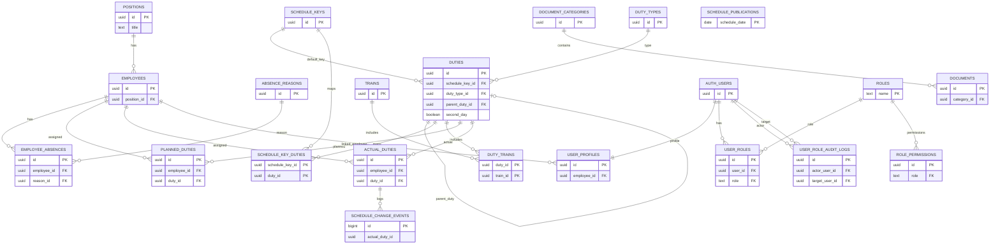

# TrainCrewHub

[English](README.md) | **Български**

Платформа за управление на железопътни екипажи: повески, ключ-графици, планиране/реални повески, влакове, служители, отсъствия и документи. Frontend-ът е SPA (Vanilla JS + Bootstrap), а backend-ът е Supabase (PostgreSQL + Auth + Storage + RLS).

## Функционалност

### Аутентикация
- **Вход** с имейл или потребителско име и парола.
- **Регистрация** с потребителско име, имейл, собствено/фамилно ime и парола.
- **Забравена парола** — заявка за линк за смяна на парола по имейл или потребителско име.
- **Смяна на парола** — задаване на нова парола чрез защитен линк, изпратен на имейл.
- **Активиране на акаунт** — нови акаунти изискват одобрение от администратор преди достъп. Потребители без роля виждат екран „Очакващ достъп".
- Бутони за показване/скриване на парола на всички полета за парола.

### Роли и права за достъп
- Контрол на достъпа базиран на роли чрез таблица `user_roles` и каталог `roles`.
- RLS политики на всички таблици налагат достъпа на ниво база данни.
- UI guards: екраните и действията са скрити/деактивирани спрямо ролята и правата на текущия потребител.
- Обхвати на права по роля: `none`, `own`, `linked_employee`, `all` — за четене, създаване, редакция, изтриване и видимост на екран.
- Вградена защита: последният администратор не може да бъде премахнат.

### Админ панел
- **Таб Роли**: задаване и премахване на роли за всеки потребител; преглед на пълния списък с роли.
- **Лог на ролеви промени**: пълна история на всички промени (кой е сменил какво, кога, за кого).
- **Таб Профили**: преглед на всички потребителски профили; свързване на профил към запис на служител.
- **Таб Права**: преглед и редакция на права по роля за всеки ресурс.
- Само-администраторска Edge Function за хард-изтриване на потребител (премахва от `auth.users`, `user_roles`, `user_profiles` и лог).

### Ключ-графици
- Създаване, редакция и изтриване на ключ-графици (период на валидност, тип, роля екипаж).
- Преглед и управление на повески, прикачени към ключ-график.
- Пренареждане на повески чрез drag-and-drop.
- Прикачване на съществуващи повески или създаване на нови директно от екрана.

### Повески
- Пълен CRUD: наименование, начален/краен час, прекъсване (начало/край), продължителност, втори ден, бележки.
- **Повески на втори ден**: повеска може да обхваща два календарни дни. Дъщерна повеска (свързана чрез `parent_duty_id`) се изпълнява на следващия ден.
- **Автоматично каскадиране на реалните назначения**: при назначаване в родителска повеска (INSERT/UPDATE/DELETE), DB тригери автоматично отразяват действието в `actual_duties` записа на дъщерната повеска за следващата дата.
- **Визуален индикатор за каскадни записи**: назначения, създадени чрез каскада, са маркирани с 🔗 икона в таблото на графика.
- Профил на повеска с всички детайли и прикачени влакове.
- Дублиране на повеска.
- Прикачване и управление на файлови приложения към повеска (Storage).
- Поле за бележки с tooltip в таблата.

### Типове повески
- Управление на номенклатурния списък с типове повески.
- Типовете се използват за категоризация и филтриране в таблата.

### Влакове
- Създаване, редакция и изтриване на влакове.
- Качване и прикачване на файлове с разписания към влак (Supabase Storage).
- Преглед на разписания директно в браузъра.

### Влакове към повески
- Преглед, добавяне, редакция и откачане на влакове от конкретна повеска.
- Задаване на последователност (пореден номер) на влаковете в повеска.

### Служители
- Профили на служители: собствено/фамилно ime, длъжност, статус, табелен номер.
- Качване на снимки на служители (Supabase Storage).
- Свързване на потребителски профил към запис на служител.

### Отсъствия на служители
- Въвеждане и управление на отсъствия с причина и период.
- Отсъстващите служители се филтрират от назначенията в таблата на графика.

### Планирани повески
- Назначаване на служители с роля (началник влак / кондуктор) към повески за конкретна дата.
- Пълен CRUD за планирани записи.

### Реални повески
- Назначаване на служители с роля към повески за конкретна дата с опционални времеви корекции (начален/краен час).
- Пълен CRUD за реални записи.
- **DB тригери** каскадират INSERT, UPDATE и DELETE от родителска повеска към дъщерна за `дата + 1 ден`.

### План-график (табло)
- Визуално табло за избрана дата, групирано по тип: влакови повески, командировки, почивни дни.
- Показва планирани назначения с редове за машинист и кондуктори.
- Повески на втори ден са в отделна секция с визуален разделител.
- Табло с отсъстващи служители.
- Оптимизиран макет за печат (карта за всяка повеска).
- Експорт в PDF.

### График (табло)
- Визуално табло за реални назначения, групирани по тип: влакови повески, командировки, почивни дни.
- Drag-and-drop на назначения между повески и дати.
- Добавяне, редакция и премахване на назначения директно от таблото.
- Каскадните назначения са маркирани с 🔗 икона и tooltip.
- Навигация по дати и публикуване/потвърждаване на график за дата.
- Лог на промените в публикуван график.
- Макет за печат и експорт в PDF.

### Начало (Dashboard)
- Месечен календар за служители от екипажа с дневни назначения.
- Списък с отсъствия за избрания месец.
- Навигация между месеци.

### Документи
- CRUD за категории документи.
- Качване и управление на документи по категория (Supabase Storage).
- Преглед и отваряне на документи в браузъра.

### Потребителски профили
- Преглед на всички профили (админите виждат всичко; обикновените потребители — само собствения).
- Редакция на потребителско ime, имейл, собствено/фамилно ime и свързан служител.
- **Администратор: смяна на имейл на друг потребител** чрез Edge Function (`admin-change-user-email`) — обновява едновременно `auth.users` и `user_profiles`, без изпращане на потвърдителен имейл.
- **Администратор: изпращане на линк за смяна на парола** — изпраща reset имейл до регистрирания адрес на потребителя.
- Смяна на собствена парола директно от формата за редакция.
- Управление на активен/неактивен статус.

---

## Технологии

- Frontend: Vanilla JS (ES modules), Bootstrap 5 (CDN), Bootstrap Icons (CDN)
- Build: Vite
- Backend: Supabase (PostgreSQL, Supabase Auth, Storage, RLS policies)
- Edge Functions: Deno (TypeScript), deploy-нати в Supabase
- Hosting: Netlify

## Стартиране локално

### 1) Изисквания

- Node.js `>= 20` (Netlify build използва Node 20)

### 2) Инсталация

```bash
npm install
```

### 3) Environment variables

Създай файл `.env.local` в root-а на проекта:

```bash
VITE_SUPABASE_URL="https://YOUR_PROJECT_REF.supabase.co"
VITE_SUPABASE_PUBLISHABLE_KEY="YOUR_SUPABASE_PUBLISHABLE_KEY"
# алтернатива (backward compatible):
# VITE_SUPABASE_ANON_KEY="YOUR_SUPABASE_ANON_KEY"
```

Клиентът е в `src/services/supabaseClient.js` и ще хвърли грешка, ако липсват env var-ите.

### 4) Стартиране

```bash
npm run dev
```

Vite ще стартира на `http://localhost:5173`.

## Supabase (DB, Auth, Storage)

### Миграции

SQL миграциите са в `supabase/migrations/`.

- Не редактирай вече приложени миграции.
- За промени по схемата добавяй нова миграция (нов файл).

Как точно се прилагат миграциите зависи от това дали използваш Supabase CLI или MCP/Studio workflow. Минимално: създай Supabase проект и приложи SQL-ите от `supabase/migrations/` в правилния ред.

### Edge Functions

Edge функциите са в `supabase/functions/`. Всяка е Deno TypeScript модул.

| Функция | Предназначение |
|---|---|
| `admin-hard-delete-user-v2` | Хард-изтриване на потребител от `auth.users`, `user_roles`, `user_profiles` и лог. Само за админи. |
| `admin-change-user-email` | Смяна на имейл на потребител в `auth.users` и `user_profiles`. Само за админи. Без потвърдителен имейл. |

### Auth — имейл и redirect конфигурация

В **Supabase Dashboard → Authentication → URL Configuration**:

- **Site URL**: `https://твоя-app.netlify.app`
- **Redirect URLs**: добави `https://твоя-app.netlify.app/**` и `http://localhost:5173/**`

Това позволява на `resetPasswordForEmail` да използва `window.location.origin/reset-password` като `redirectTo`.

### Storage

Проектът използва Supabase Storage за файлове (например разписания на влакове, снимки на служители, документи). Увери се, че bucket-ите и политиките от миграциите са налични в проекта.

## Структура на базата (преглед)

Официалният източник за схемата са миграциите в `supabase/migrations/`. По-долу е кратък преглед на основните таблици и връзки.

### ER диаграма (Mermaid)


```mermaid
erDiagram
   POSITIONS {
      uuid id PK
      text title
   }
   EMPLOYEES {
      uuid id PK
      uuid position_id FK
   }
   ABSENCE_REASONS {
      uuid id PK
   }
   EMPLOYEE_ABSENCES {
      uuid id PK
      uuid employee_id FK
      uuid reason_id FK
   }
   SCHEDULE_KEYS {
      uuid id PK
   }
   DUTY_TYPES {
      uuid id PK
   }
   DUTIES {
      uuid id PK
      uuid schedule_key_id FK
      uuid duty_type_id FK
      uuid parent_duty_id FK
      boolean second_day
   }
   SCHEDULE_KEY_DUTIES {
      uuid schedule_key_id PK
      uuid duty_id PK
   }
   TRAINS {
      uuid id PK
   }
   DUTY_TRAINS {
      uuid duty_id PK
      uuid train_id PK
   }
   PLANNED_DUTIES {
      uuid id PK
      uuid employee_id FK
      uuid duty_id FK
   }
   ACTUAL_DUTIES {
      uuid id PK
      uuid employee_id FK
      uuid duty_id FK
   }
   DOCUMENT_CATEGORIES {
      uuid id PK
   }
   DOCUMENTS {
      uuid id PK
      uuid category_id FK
   }
   AUTH_USERS {
      uuid id PK
   }
   USER_PROFILES {
      uuid id PK
      uuid employee_id FK
   }
   USER_ROLES {
      uuid id PK
      uuid user_id FK
      text role FK
   }
   ROLES {
      text name PK
   }
   ROLE_PERMISSIONS {
      uuid id PK
      text role FK
   }
   USER_ROLE_AUDIT_LOGS {
      uuid id PK
      uuid actor_user_id FK
      uuid target_user_id FK
   }
   SCHEDULE_PUBLICATIONS {
      date schedule_date PK
   }
   SCHEDULE_CHANGE_EVENTS {
      bigint id PK
      uuid actual_duty_id
   }

   POSITIONS ||--o{ EMPLOYEES : has
   ABSENCE_REASONS ||--o{ EMPLOYEE_ABSENCES : reason
   EMPLOYEES ||--o{ EMPLOYEE_ABSENCES : has

   SCHEDULE_KEYS ||--o{ DUTIES : default_key
   DUTY_TYPES ||--o{ DUTIES : type
   DUTIES ||--o| DUTIES : parent_duty
   SCHEDULE_KEYS ||--o{ SCHEDULE_KEY_DUTIES : maps
   DUTIES ||--o{ SCHEDULE_KEY_DUTIES : maps

   DUTIES ||--o{ DUTY_TRAINS : includes
   TRAINS ||--o{ DUTY_TRAINS : includes

   EMPLOYEES ||--o{ PLANNED_DUTIES : assigned
   DUTIES ||--o{ PLANNED_DUTIES : planned

   EMPLOYEES ||--o{ ACTUAL_DUTIES : assigned
   DUTIES ||--o{ ACTUAL_DUTIES : actual
   ACTUAL_DUTIES ||--o{ SCHEDULE_CHANGE_EVENTS : logs

   DOCUMENT_CATEGORIES ||--o{ DOCUMENTS : contains

   AUTH_USERS ||--|| USER_PROFILES : profile
   EMPLOYEES ||--o{ USER_PROFILES : linked_employee

   AUTH_USERS ||--o{ USER_ROLES : has
   ROLES ||--o{ USER_ROLES : role
   ROLES ||--o{ ROLE_PERMISSIONS : permissions

   AUTH_USERS ||--o{ USER_ROLE_AUDIT_LOGS : actor
   AUTH_USERS ||--o{ USER_ROLE_AUDIT_LOGS : target
```

Бележки:
- Диаграмата е опростена (не показва всички колони/индекси/constraints).
- `AUTH_USERS` представлява `auth.users` в Supabase.
- `DUTIES.parent_duty_id` свързва дъщерна повеска (ден 2) с родителска (ден 1).

### Номенклатури и хора

- `positions` (длъжности)
- `employees` → `positions` (`employees.position_id`)
- `absence_reasons` (причини)
- `employee_absences` → `employees`, `absence_reasons`

### Графици

- `schedule_keys` (валидност + тип)
- `duty_types`
- `duties` → `schedule_keys` (`duties.schedule_key_id`, опционално) и → `duty_types` (`duties.duty_type_id`)
- `duties.second_day` + `duties.parent_duty_id` — свързва дъщерна повеска (ден 2) с родителска (ден 1)
- `schedule_key_duties` (many-to-many) → `schedule_keys` + `duties`

### Влакове

- `trains` (вкл. `timetable_url` / референции към файлове с разписания)
- `duty_trains` (many-to-many) → `duties` + `trains` + `sequence_order`

### Назначения

- `planned_duties` → `employees` + `duties` (по `date`, с `assignment_role`)
- `actual_duties` → `employees` + `duties` (по `date`, с `assignment_role` и time overrides)
- DB тригери каскадират INSERT / UPDATE / DELETE от родителска повеска към дъщерна за `дата + 1 ден`

### Документи

- `document_categories`
- `documents` → `document_categories`

### Потребители и права

- Supabase потребителите са в `auth.users`
- `user_profiles` е 1:1 към `auth.users` и може да е свързан към `employees` (`user_profiles.employee_id`)
- `user_roles` задава роли на потребители (FK към `auth.users`)
- `roles` е каталог с роли, използван от `user_roles` / `role_permissions`
- `role_permissions` пази права по ресурс за роля
- `user_role_audit_logs` пази лог на промени по роли

### Публикуване/аудит на график

- `schedule_publications` пази потвърждение по дата
- `schedule_change_events` логва промени в `actual_duties`

## Деплой (Netlify)

Конфигурацията е в `netlify.toml`:

- Build command: `npm run build`
- Publish: `dist`
- Redirect: `/* -> /index.html` (за SPA routing)

В Netlify добави environment variables:

- `VITE_SUPABASE_URL`
- `VITE_SUPABASE_PUBLISHABLE_KEY` (или `VITE_SUPABASE_ANON_KEY`)

## Структура на проекта (накратко)

Основни папки и отговорности:

```text
.
├─ index.html                # Bootstrap + Bootstrap Icons (CDN) + entry към src/main.js
├─ src/
│  ├─ main.js                 # bootstrap на приложението (page shell + router)
│  ├─ router.js               # SPA routing + access guards (сесия/роля/permissions)
│  ├─ styles.css              # глобални стилове + дизайн токени
│  ├─ components/             # общи UI компоненти (header/footer/toast/page shell)
│  ├─ pages/                  # страници (по папка за page)
│  │  └─ <page>/
│  │     ├─ <page>.html
│  │     └─ js/                # page orchestrator + модули (state/helpers/table/...)
│  ├─ services/               # външни услуги (Supabase client)
│  └─ utils/                  # общи помощни модули (auth, permissions, pagination, др.)
└─ supabase/
   ├─ migrations/             # миграции за DB/RLS/Storage (не се редактират постфактум)
   └─ functions/              # Edge functions
      ├─ admin-hard-delete-user-v2/
      └─ admin-change-user-email/
```

Страниците следват конвенцията:

```text
src/pages/<page>/<page>.html
src/pages/<page>/js/<page>.js
src/pages/<page>/js/helpers.js
src/pages/<page>/js/state.js
src/pages/<page>/js/table.js   # когато има таблица/листинг
```

Това позволява всяка страница да има собствено състояние, рендер и handlers без да се смесва логика между екраните.

## Скриптове

- `npm run dev` – старт на dev сървър
- `npm run build` – production build
- `npm run preview` – preview на build
