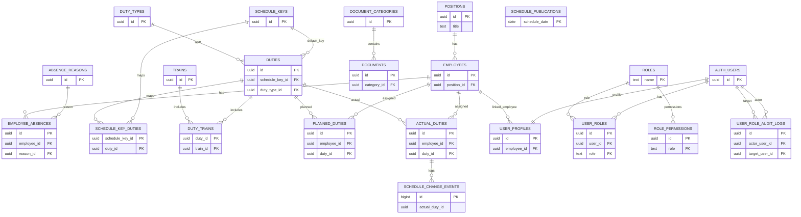

# TrainCrewHub

[English](README.md) | **Български**

Платформа за управление на железопътни екипажи: повески, ключ-графици, планиране/реални повески, влакове, служители, отсъствия и документи. Frontend-ът е SPA (Vanilla JS + Bootstrap), а backend-ът е Supabase (PostgreSQL + Auth + Storage + RLS).

## Функционалност (накратко)

- Аутентикация със Supabase Auth: вход/регистрация, забравена парола и reset.
- Роли и права за достъп (RLS + UI guards) – екраните и действията са ограничени според ролята/разрешенията.
- Ключ-графици: създаване/редакция/изтриване и преглед на повески към ключ-график.
- Повески: управление на повески, профил, копиране, прикачване/управление на влакове към повеска.
- Типове повески: поддръжка на номенклатура.
- Влакове: поддръжка на влакове + прикачване на файлове с разписания (Storage).
- Влакове към повески: списък/добавяне/редакция/откачане на влакове към конкретна повеска.
- Служители: профили на служители, позиции/статус и файлове (напр. снимки) през Storage.
- Отсъствия: въвеждане и управление на отсъствия за служители.
- Планирани и реални повески: назначаване на служители/роля към повеска по дати.
- План-график и график: екрани за визуализация/работа с планирането и реалните назначения.
- Документи: управление на документи по категории + преглед/отваряне.
- Потребителски профили: преглед/редакция (и админ действия при наличие на права).

## Технологии

- Frontend: Vanilla JS (ES modules), Bootstrap 5 (CDN), Bootstrap Icons (CDN)
- Build: Vite
- Backend: Supabase (PostgreSQL, Supabase Auth, Storage, RLS policies)
- Hosting: Netlify

## Стартиране локално

### 1) Изисквания

- Node.js `>= 20` (Netlify build използва Node 20)

### 2) Инсталация

```bash
npm install
```

### 3) Environment variables

Създай файл `.env.local` в root-а на проекта:

```bash
VITE_SUPABASE_URL="https://YOUR_PROJECT_REF.supabase.co"
VITE_SUPABASE_PUBLISHABLE_KEY="YOUR_SUPABASE_PUBLISHABLE_KEY"
# алтернатива (backward compatible):
# VITE_SUPABASE_ANON_KEY="YOUR_SUPABASE_ANON_KEY"
```

Клиентът е в `src/services/supabaseClient.js` и ще хвърли грешка, ако липсват env var-ите.

### 4) Стартиране

```bash
npm run dev
```

Vite ще стартира на `http://localhost:5173`.

## Supabase (DB, Auth, Storage)

### Миграции

SQL миграциите са в `supabase/migrations/`.

- Не редактирай вече приложени миграции.
- За промени по схемата добавяй нова миграция (нов файл).

Как точно се прилагат миграциите зависи от това дали използваш Supabase CLI или MCP/Studio workflow. Минимално: създай Supabase проект и приложи SQL-ите от `supabase/migrations/` в правилния ред.

### Storage

Проектът използва Supabase Storage за файлове (например разписания на влакове, снимки на служители, документи). Увери се, че bucket-ите и политиките от миграциите са налични в проекта.

## Структура на базата (преглед)

Официалният източник за схемата са миграциите в `supabase/migrations/`. По-долу е кратък преглед на основните таблици и връзки.

### ER диаграма (Mermaid)



Бележки:
- Диаграмата е опростена (не показва всички колони/индекси/constraints).
- `AUTH_USERS` представлява `auth.users` в Supabase.

### Номенклатури и хора

- `positions` (длъжности)
- `employees` → `positions` (`employees.position_id`)
- `absence_reasons` (причини)
- `employee_absences` → `employees`, `absence_reasons`

### Графици

- `schedule_keys` (валидност + тип)
- `duty_types`
- `duties` → `schedule_keys` (`duties.schedule_key_id`, опционално) и → `duty_types` (`duties.duty_type_id`)
- `schedule_key_duties` (many-to-many) → `schedule_keys` + `duties`

### Влакове

- `trains` (вкл. `timetable_url` / референции към файлове с разписания)
- `duty_trains` (many-to-many) → `duties` + `trains` + `sequence_order`

### Назначения

- `planned_duties` → `employees` + `duties` (по `date`, с `assignment_role`)
- `actual_duties` → `employees` + `duties` (по `date`, с `assignment_role` и time overrides)

### Документи

- `document_categories`
- `documents` → `document_categories`

### Потребители и права

- Supabase потребителите са в `auth.users`
- `user_profiles` е 1:1 към `auth.users` и може да е свързан към `employees` (`user_profiles.employee_id`)
- `user_roles` задава роли на потребители (FK към `auth.users`)
- `roles` е каталог с роли, използван от `user_roles` / `role_permissions`
- `role_permissions` пази права по ресурс за роля
- `user_role_audit_logs` пази лог на промени по роли

### Публикуване/аудит на график

- `schedule_publications` пази потвърждение по дата
- `schedule_change_events` логва промени в `actual_duties`

## Деплой (Netlify)

Конфигурацията е в `netlify.toml`:

- Build command: `npm run build`
- Publish: `dist`
- Redirect: `/* -> /index.html` (за SPA routing)

В Netlify добави environment variables:

- `VITE_SUPABASE_URL`
- `VITE_SUPABASE_PUBLISHABLE_KEY` (или `VITE_SUPABASE_ANON_KEY`)

## Структура на проекта (накратко)

Основни папки и отговорности:

```text
.
├─ index.html                # Bootstrap + Bootstrap Icons (CDN) + entry към src/main.js
├─ src/
│  ├─ main.js                 # bootstrap на приложението (page shell + router)
│  ├─ router.js               # SPA routing + access guards (сесия/роля/permissions)
│  ├─ styles.css              # глобални стилове + дизайн токени
│  ├─ components/             # общи UI компоненти (header/footer/toast/page shell)
│  ├─ pages/                  # страници (по папка за page)
│  │  └─ <page>/
│  │     ├─ <page>.html
│  │     └─ js/                # page orchestrator + модули (state/helpers/table/...)
│  ├─ services/               # външни услуги (Supabase client)
│  └─ utils/                  # общи помощни модули (auth, permissions, pagination, др.)
└─ supabase/
   ├─ migrations/             # миграции за DB/RLS/Storage (не се редактират постфактум)
   └─ functions/              # Edge functions (ако са налични)
```

Страниците следват конвенцията:

```text
src/pages/<page>/<page>.html
src/pages/<page>/js/<page>.js
src/pages/<page>/js/helpers.js
src/pages/<page>/js/state.js
src/pages/<page>/js/table.js   # когато има таблица/листинг
```

Това позволява всяка страница да има собствено състояние, рендер и handlers без да се смесва логика между екраните.

## Скриптове

- `npm run dev` – старт на dev сървър
- `npm run build` – production build
- `npm run preview` – preview на build
