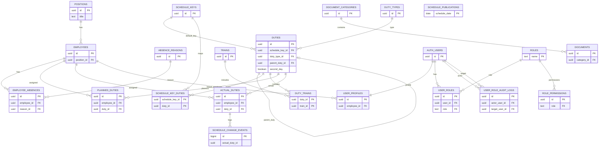

# TrainCrewHub

**English** | [Български](README.bg.md)

TrainCrewHub is a platform for managing train crew schedules, assignments, and supporting reference data: duties, schedule keys, planning/actual duty assignments, trains, employees, absences, and documents. The frontend is a SPA (Vanilla JS + Bootstrap) and the backend is Supabase (PostgreSQL + Auth + Storage + Row Level Security).

## Features

### Authentication
- **Sign in** with email or username and password.
- **Register** with username, email, first/last name and password.
- **Forgot password** — request a reset link by entering email or username.
- **Reset password** — set a new password via a secure link sent by email.
- **Account activation** — new accounts require admin activation before access is granted. Users without a role see a "pending access" screen.
- Password visibility toggles on all password inputs.

### Roles & Access Control
- Role-based access control via a `user_roles` table and a `roles` catalog.
- Row Level Security (RLS) policies on all tables enforce access at the database level.
- UI guards: pages and actions are hidden/disabled based on the current user's role and per-resource permissions.
- Per-role permission scopes: `none`, `own`, `linked_employee`, `all` — for read, create, edit, delete and screen visibility actions.
- Built-in protection: the last admin cannot be removed.

### Admin Panel
- **Roles tab**: assign and remove roles for any user; view the full list of role assignments.
- **Role audit log**: complete history of all role changes (who changed what, when, for whom).
- **Profiles tab**: view all user profiles; link a profile to an employee record.
- **Permissions tab**: view and edit per-role permissions for each resource.
- Admin-only Edge Function for hard-deleting a user (removes from `auth.users`, `user_roles`, `user_profiles` and audit logs).

### Schedule Keys
- Create, edit and delete schedule keys (date ranges with type and crew role).
- View and manage the list of duties linked to a specific schedule key.
- Reorder duties within a schedule key via drag-and-drop.
- Attach existing duties to a schedule key or create new ones inline.

### Duties
- Full CRUD: name, start/end time, break start/end, duration, has second day, notes.
- **Second-day duties**: a duty can span two calendar days. A child duty (linked via `parent_duty_id`) runs on the next day.
- **Auto-cascade actual assignments**: when a parent duty is assigned (insert/update/delete), DB triggers automatically mirror the action to the child duty's `actual_duties` record on the next date.
- **Visual cascade indicator**: assignments created by cascade are marked with a 🔗 icon in the schedule board.
- Duty profile view with all details and linked trains.
- Duplicate a duty.
- Attach and manage file attachments per duty (Storage).
- Notes field with tooltip display in schedule boards.

### Duty Types
- Manage the reference list of duty type categories.
- Duty types are used to categorise duties and filter them in boards.

### Trains
- Create, edit and delete trains.
- Upload and attach timetable files per train (Supabase Storage).
- Preview timetable files directly in the browser.

### Trains for Duties
- View, add, edit and detach trains linked to a specific duty.
- Set sequence order for trains within a duty.

### Employees
- Employee profiles: first/last name, position, employment status, tab number.
- Upload employee photos (Supabase Storage).
- Link a user profile to an employee record.

### Employee Absences
- Record and manage absences per employee with reason and date range.
- Absent employees are filtered out from assignments in schedule boards.

### Planned Duties
- Assign employees and an assignment role (chief / conductor) to duties on a specific date.
- Full CRUD for planned duty records.

### Actual Duties
- Assign employees and role to duties per date with optional time overrides (start/end).
- Full CRUD for actual duty records.
- **DB triggers** cascade INSERT, UPDATE and DELETE from parent duty to child duty on `date + 1 day`.

### Plan Schedule (board view)
- Visual board for a selected date grouped by duty type: train duties, business trips, day-off duties.
- Shows planned assignments per duty with chief and conductor rows.
- Second-day duties displayed in a separate section with a visual separator.
- Absence board showing absent employees.
- Print-optimised layout with card-per-duty format.
- Export to PDF.

### Schedule (board view)
- Visual board for actual assignments grouped by duty type: train duties, business trips, day-off duties.
- Drag-and-drop of assignments between duties and dates.
- Add, edit and remove assignments directly from the board.
- Cascade assignments marked with 🔗 icon and tooltip.
- Date navigation and schedule publication/confirmation per date.
- Change event log for published schedules.
- Print layout and PDF export.

### Dashboard (Home)
- Monthly calendar for crew members showing daily duty assignments.
- Absence list for the selected month.
- Navigation between months.

### Documents
- Document categories CRUD.
- Upload and manage documents per category (Supabase Storage).
- Preview and open documents in the browser.

### User Profiles
- View all user profiles (admins see all; regular users see only their own).
- Edit username, email, first/last name and linked employee.
- **Admin: change another user's email** via a dedicated Edge Function (`admin-change-user-email`) — updates both `auth.users` and `user_profiles` atomically, no confirmation email required.
- **Admin: send password reset link** — sends a reset email to the user's registered address.
- Change own password directly from the edit form.
- Active/inactive status management.

---

## Tech stack

- Frontend: Vanilla JS (ES modules), Bootstrap 5 (CDN), Bootstrap Icons (CDN)
- Build: Vite
- Backend: Supabase (PostgreSQL, Supabase Auth, Storage, RLS policies)
- Edge Functions: Deno (TypeScript), deployed to Supabase
- Hosting: Netlify

## Local development

### 1) Requirements

- Node.js `>= 20` (Netlify builds use Node 20)

### 2) Install

```bash
npm install
```

### 3) Environment variables

Create a `.env.local` file in the project root:

```bash
VITE_SUPABASE_URL="https://YOUR_PROJECT_REF.supabase.co"
VITE_SUPABASE_PUBLISHABLE_KEY="YOUR_SUPABASE_PUBLISHABLE_KEY"
# alternative (backward compatible):
# VITE_SUPABASE_ANON_KEY="YOUR_SUPABASE_ANON_KEY"
```

The client is in `src/services/supabaseClient.js` and will throw if required env vars are missing.

### 4) Run

```bash
npm run dev
```

Vite runs on `http://localhost:5173`.

## Supabase (DB, Auth, Storage)

### Migrations

SQL migrations live in `supabase/migrations/`.

- Do not edit migrations that have already been applied.
- For schema changes, add a new migration file.

How you apply migrations depends on your workflow (Supabase CLI vs MCP/Studio). At minimum: create a Supabase project and apply the SQL files from `supabase/migrations/` in order.

### Edge Functions

Edge functions live in `supabase/functions/`. Each function is a Deno TypeScript module.

| Function | Purpose |
|---|---|
| `admin-hard-delete-user-v2` | Hard-delete a user from `auth.users`, `user_roles`, `user_profiles` and audit logs. Admin-only. |
| `admin-change-user-email` | Change any user's email in both `auth.users` and `user_profiles`. Admin-only. No confirmation email sent. |

### Auth — Email & Redirect configuration

In **Supabase Dashboard → Authentication → URL Configuration**:

- **Site URL**: `https://your-app.netlify.app`
- **Redirect URLs**: add both `https://your-app.netlify.app/**` and `http://localhost:5173/**`

This allows `resetPasswordForEmail` to use `window.location.origin/reset-password` as `redirectTo`.

### Storage

The project uses Supabase Storage for files (e.g. train timetables, employee photos, documents). Make sure the required buckets and policies from the migrations exist in your Supabase project.

## Database schema (overview)

The authoritative schema is the migrations in `supabase/migrations/`. Below is a high-level overview of the main entities and relationships.

### ER diagram (Mermaid)


```mermaid
erDiagram
   POSITIONS {
      uuid id PK
      text title
   }
   EMPLOYEES {
      uuid id PK
      uuid position_id FK
   }
   ABSENCE_REASONS {
      uuid id PK
   }
   EMPLOYEE_ABSENCES {
      uuid id PK
      uuid employee_id FK
      uuid reason_id FK
   }
   SCHEDULE_KEYS {
      uuid id PK
   }
   DUTY_TYPES {
      uuid id PK
   }
   DUTIES {
      uuid id PK
      uuid schedule_key_id FK
      uuid duty_type_id FK
      uuid parent_duty_id FK
      boolean second_day
   }
   SCHEDULE_KEY_DUTIES {
      uuid schedule_key_id PK
      uuid duty_id PK
   }
   TRAINS {
      uuid id PK
   }
   DUTY_TRAINS {
      uuid duty_id PK
      uuid train_id PK
   }
   PLANNED_DUTIES {
      uuid id PK
      uuid employee_id FK
      uuid duty_id FK
   }
   ACTUAL_DUTIES {
      uuid id PK
      uuid employee_id FK
      uuid duty_id FK
   }
   DOCUMENT_CATEGORIES {
      uuid id PK
   }
   DOCUMENTS {
      uuid id PK
      uuid category_id FK
   }
   AUTH_USERS {
      uuid id PK
   }
   USER_PROFILES {
      uuid id PK
      uuid employee_id FK
   }
   USER_ROLES {
      uuid id PK
      uuid user_id FK
      text role FK
   }
   ROLES {
      text name PK
   }
   ROLE_PERMISSIONS {
      uuid id PK
      text role FK
   }
   USER_ROLE_AUDIT_LOGS {
      uuid id PK
      uuid actor_user_id FK
      uuid target_user_id FK
   }
   SCHEDULE_PUBLICATIONS {
      date schedule_date PK
   }
   SCHEDULE_CHANGE_EVENTS {
      bigint id PK
      uuid actual_duty_id
   }

   POSITIONS ||--o{ EMPLOYEES : has
   ABSENCE_REASONS ||--o{ EMPLOYEE_ABSENCES : reason
   EMPLOYEES ||--o{ EMPLOYEE_ABSENCES : has

   SCHEDULE_KEYS ||--o{ DUTIES : default_key
   DUTY_TYPES ||--o{ DUTIES : type
   DUTIES ||--o| DUTIES : parent_duty
   SCHEDULE_KEYS ||--o{ SCHEDULE_KEY_DUTIES : maps
   DUTIES ||--o{ SCHEDULE_KEY_DUTIES : maps

   DUTIES ||--o{ DUTY_TRAINS : includes
   TRAINS ||--o{ DUTY_TRAINS : includes

   EMPLOYEES ||--o{ PLANNED_DUTIES : assigned
   DUTIES ||--o{ PLANNED_DUTIES : planned

   EMPLOYEES ||--o{ ACTUAL_DUTIES : assigned
   DUTIES ||--o{ ACTUAL_DUTIES : actual
   ACTUAL_DUTIES ||--o{ SCHEDULE_CHANGE_EVENTS : logs

   DOCUMENT_CATEGORIES ||--o{ DOCUMENTS : contains

   AUTH_USERS ||--|| USER_PROFILES : profile
   EMPLOYEES ||--o{ USER_PROFILES : linked_employee

   AUTH_USERS ||--o{ USER_ROLES : has
   ROLES ||--o{ USER_ROLES : role
   ROLES ||--o{ ROLE_PERMISSIONS : permissions

   AUTH_USERS ||--o{ USER_ROLE_AUDIT_LOGS : actor
   AUTH_USERS ||--o{ USER_ROLE_AUDIT_LOGS : target
```

Notes:
- The diagram is intentionally simplified (not every column/index/constraint is shown).
- `AUTH_USERS` represents `auth.users` in Supabase.
- `DUTIES.parent_duty_id` links a second-day child duty to its parent.

### Reference & people

- `positions` (job titles)
- `employees` → `positions` (`employees.position_id`)
- `absence_reasons`
- `employee_absences` → `employees`, `absence_reasons`

### Scheduling

- `schedule_keys` (date ranges + type)
- `duty_types`
- `duties` → `schedule_keys` (`duties.schedule_key_id`, optional) and → `duty_types` (`duties.duty_type_id`)
- `duties.second_day` + `duties.parent_duty_id` — links a child duty (day 2) to its parent (day 1)
- `schedule_key_duties` (many-to-many) → `schedule_keys` + `duties`

### Trains

- `trains` (includes `timetable_url` / timetable file references)
- `duty_trains` (many-to-many) → `duties` + `trains` + `sequence_order`

### Assignments

- `planned_duties` → `employees` + `duties` (by `date`, includes `assignment_role`)
- `actual_duties` → `employees` + `duties` (by `date`, includes `assignment_role` and time overrides)
- DB triggers cascade INSERT / UPDATE / DELETE from parent duty to child duty on `date + 1 day`

### Documents

- `document_categories`
- `documents` → `document_categories`

### Auth & permissions

- Supabase Auth users live in `auth.users`
- `user_profiles` is 1:1 with `auth.users` and can link to `employees` (`user_profiles.employee_id`)
- `user_roles` assigns app roles to users (FK to `auth.users`)
- `roles` is a roles catalog used by `user_roles` / `role_permissions`
- `role_permissions` stores per-role permissions by resource
- `user_role_audit_logs` records role changes

### Schedule audit / publishing

- `schedule_publications` stores per-date confirmation state
- `schedule_change_events` logs changes in `actual_duties`

## Deployment (Netlify)

Configuration is in `netlify.toml`:

- Build command: `npm run build`
- Publish: `dist`
- Redirect: `/* -> /index.html` (SPA routing)

In Netlify, set environment variables:

- `VITE_SUPABASE_URL`
- `VITE_SUPABASE_PUBLISHABLE_KEY` (or `VITE_SUPABASE_ANON_KEY`)

## Project structure

Main folders and responsibilities:

```text
.
├─ index.html                # Bootstrap + Bootstrap Icons (CDN) + entry to src/main.js
├─ src/
│  ├─ main.js                 # app bootstrap (page shell + router)
│  ├─ router.js               # SPA routing + access guards (session/role/permissions)
│  ├─ styles.css              # global styles + design tokens
│  ├─ components/             # shared UI components (header/footer/toast/page shell)
│  ├─ pages/                  # pages (one folder per page)
│  │  └─ <page>/
│  │     ├─ <page>.html
│  │     └─ js/                # page orchestrator + modules (state/helpers/table/...)
│  ├─ services/               # external services (Supabase client)
│  └─ utils/                  # shared utilities (auth, permissions, pagination, ...)
└─ supabase/
   ├─ migrations/             # DB/RLS/Storage migrations (append-only)
   └─ functions/              # Edge Functions
      ├─ admin-hard-delete-user-v2/
      └─ admin-change-user-email/
```

Pages follow this convention:

```text
src/pages/<page>/<page>.html
src/pages/<page>/js/<page>.js
src/pages/<page>/js/helpers.js
src/pages/<page>/js/state.js
src/pages/<page>/js/table.js   # when the page has a table/listing
```

This keeps each page's state/render/handlers isolated and avoids cross-page coupling.

## Scripts

- `npm run dev` – start dev server
- `npm run build` – production build
- `npm run preview` – preview the build
