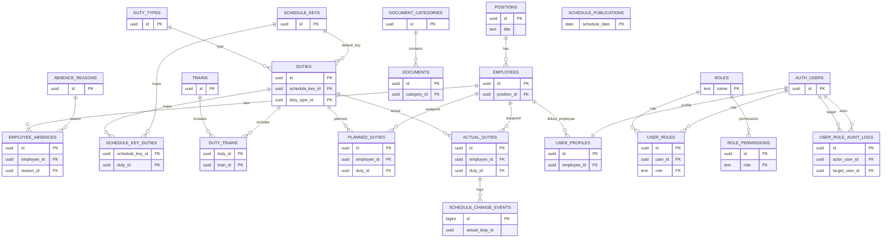

# TrainCrewHub

**English** | [Български](README.bg.md)

TrainCrewHub is a platform for managing train crew schedules, assignments, and supporting reference data: duties, schedule keys, planning/actual duty assignments, trains, employees, absences, and documents. The frontend is a SPA (Vanilla JS + Bootstrap) and the backend is Supabase (PostgreSQL + Auth + Storage + Row Level Security).

## Features (high level)

- Supabase Auth: sign in/register, forgot password, reset password.
- Roles & access control (RLS + UI permission guards).
- Schedule keys: CRUD and view duties linked to a schedule key.
- Duties: manage duties, duty profile, duplicate, attach/manage trains for a duty.
- Duty types: reference data management.
- Trains: manage trains + upload and attach timetable files (Storage).
- Trains for duties: list/add/edit/detach trains linked to a specific duty.
- Employees: employee profiles, position/status, files (e.g. photos) via Storage.
- Absences: manage employee absences.
- Planned & actual duties: assign employees/roles to duties by date.
- Plan schedule & schedule: screens for planning and actual assignments.
- Documents: documents by category + preview/open.
- User profiles: view/edit (and admin-only actions when permitted).

## Tech stack

- Frontend: Vanilla JS (ES modules), Bootstrap 5 (CDN), Bootstrap Icons (CDN)
- Build: Vite
- Backend: Supabase (PostgreSQL, Supabase Auth, Storage, RLS policies)
- Hosting: Netlify

## Local development

### 1) Requirements

- Node.js `>= 20` (Netlify builds use Node 20)

### 2) Install

```bash
npm install
```

### 3) Environment variables

Create a `.env.local` file in the project root:

```bash
VITE_SUPABASE_URL="https://YOUR_PROJECT_REF.supabase.co"
VITE_SUPABASE_PUBLISHABLE_KEY="YOUR_SUPABASE_PUBLISHABLE_KEY"
# alternative (backward compatible):
# VITE_SUPABASE_ANON_KEY="YOUR_SUPABASE_ANON_KEY"
```

The client is in `src/services/supabaseClient.js` and will throw if required env vars are missing.

### 4) Run

```bash
npm run dev
```

Vite runs on `http://localhost:5173`.

## Supabase (DB, Auth, Storage)

### Migrations

SQL migrations live in `supabase/migrations/`.

- Do not edit migrations that have already been applied.
- For schema changes, add a new migration file.

How you apply migrations depends on your workflow (Supabase CLI vs MCP/Studio). At minimum: create a Supabase project and apply the SQL files from `supabase/migrations/` in order.

### Storage

The project uses Supabase Storage for files (e.g. train timetables, employee photos, documents). Make sure the required buckets and policies from the migrations exist in your Supabase project.

## Database schema (overview)

The authoritative schema is the migrations in `supabase/migrations/`. Below is a high-level overview of the main entities and relationships.

### ER diagram (Mermaid)



Notes:
- The diagram is intentionally simplified (not every column/index/constraint is shown).
- `AUTH_USERS` represents `auth.users` in Supabase.

### Reference & people

- `positions` (job titles)
- `employees` → `positions` (`employees.position_id`)
- `absence_reasons`
- `employee_absences` → `employees`, `absence_reasons`

### Scheduling

- `schedule_keys` (date ranges + type)
- `duty_types`
- `duties` → `schedule_keys` (`duties.schedule_key_id`, optional) and → `duty_types` (`duties.duty_type_id`)
- `schedule_key_duties` (many-to-many) → `schedule_keys` + `duties`

### Trains

- `trains` (includes `timetable_url` / timetable file references)
- `duty_trains` (many-to-many) → `duties` + `trains` + `sequence_order`

### Assignments

- `planned_duties` → `employees` + `duties` (by `date`, includes `assignment_role`)
- `actual_duties` → `employees` + `duties` (by `date`, includes `assignment_role` and time overrides)

### Documents

- `document_categories`
- `documents` → `document_categories`

### Auth & permissions

- Supabase Auth users live in `auth.users`
- `user_profiles` is 1:1 with `auth.users` and can link to `employees` (`user_profiles.employee_id`)
- `user_roles` assigns app roles to users (FK to `auth.users`)
- `roles` is a roles catalog used by `user_roles` / `role_permissions`
- `role_permissions` stores per-role permissions by resource
- `user_role_audit_logs` records role changes

### Schedule audit / publishing

- `schedule_publications` stores per-date confirmation state
- `schedule_change_events` logs changes in `actual_duties`

## Deployment (Netlify)

Configuration is in `netlify.toml`:

- Build command: `npm run build`
- Publish: `dist`
- Redirect: `/* -> /index.html` (SPA routing)

In Netlify, set environment variables:

- `VITE_SUPABASE_URL`
- `VITE_SUPABASE_PUBLISHABLE_KEY` (or `VITE_SUPABASE_ANON_KEY`)

## Project structure

Main folders and responsibilities:

```text
.
├─ index.html                # Bootstrap + Bootstrap Icons (CDN) + entry to src/main.js
├─ src/
│  ├─ main.js                 # app bootstrap (page shell + router)
│  ├─ router.js               # SPA routing + access guards (session/role/permissions)
│  ├─ styles.css              # global styles + design tokens
│  ├─ components/             # shared UI components (header/footer/toast/page shell)
│  ├─ pages/                  # pages (one folder per page)
│  │  └─ <page>/
│  │     ├─ <page>.html
│  │     └─ js/                # page orchestrator + modules (state/helpers/table/...)
│  ├─ services/               # external services (Supabase client)
│  └─ utils/                  # shared utilities (auth, permissions, pagination, ...)
└─ supabase/
   ├─ migrations/             # DB/RLS/Storage migrations (append-only)
   └─ functions/              # Edge Functions (if present)
```

Pages follow this convention:

```text
src/pages/<page>/<page>.html
src/pages/<page>/js/<page>.js
src/pages/<page>/js/helpers.js
src/pages/<page>/js/state.js
src/pages/<page>/js/table.js   # when the page has a table/listing
```

This keeps each page's state/render/handlers isolated and avoids cross-page coupling.

## Scripts

- `npm run dev` – start dev server
- `npm run build` – production build
- `npm run preview` – preview the build
